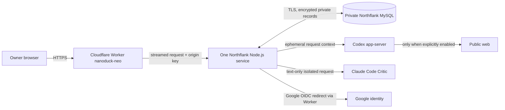

# NanoDuck Neo architecture

27 September 2026 · Northflank reconciliation · Electric A v8 with the authorized scoped reading and liquid-glass override

## Source references

This architecture consumes the current product intent and full structural SDD chain: [product idea](product-idea.md), [PRD](prd.md), [project context](project-context.md), [canonical terms](canonical-terms.md), [guardrails](guardrails.md), [user journey](user-journey.md), [screen map](screen-map.md), [wireframes](wireframes.md) and [design brief](design-brief.md). It also consumes the exact [model-settings record](model-settings.md), [Northflank deployment contract](northflank-deployment.md), the 27 September implementation/source receipts under `forge/runs/combined-updates-port-20260927/` and their verification record.

The implementation observations below were made in this Neo checkout on 27 September 2026. The principal source hashes were:

| Source group | Bound source and SHA-256 |
|---|---|
| Product specification | `docs/product-idea.md` — `b7fd0e6ef45ef33058142406cc936ab94e60734ea88212be43389d49d3fc59e5`; `docs/prd.md` — `b0ced0cbd750b0da8140f6fcdb1a73359809fe1f345dece5f543d7bff0e5806f`; `docs/project-context.md` — `239aafdfbc5d27e8b9deae10ea15528810f5cd77b1be4b916606770846e52c44`; `docs/canonical-terms.md` — `4311a658b643bf9a78c6aec23f43ead633295a864837442430e08ed80cdf7dff`; `docs/guardrails.md` — `62c81b90359c05a43e779e9abd31a3f1fa3ad9102903d04a3feb04a63a8e751d` |
| Experience specification | `docs/user-journey.md` — `1544a18c8fd1caa33950c92a61ca92fddac31527cb26ab52af45ec868e60b7a7`; `docs/screen-map.md` — `a82efbf92c011348f43334652163499d8d8f4923bc4c97d29e0fbac500055d3b`; `docs/wireframes.md` — `ebb999ecd2b89078782c37927e4ad793609746372b970af25c3388de44523c91`; `docs/design-brief.md` — `67d8698646247b31e9650ffda277273c35d4c45e9d0dd5b5aa51e59078473da0` |
| Hosting and settings | `docs/model-settings.md` — `04eba2e9d28702a3632ce9434a591fb30fecfd794c9f895ed484ca94aa7f99fc`; `docs/northflank-deployment.md` — `218dc41b7e29a85319399ce4ca785b1b915d9744203ae651ed584d8592ecd4c1` |
| Authorization and source | Current hashes for `forge/runs/combined-updates-port-20260927/implementation-prompt.json`, `source-input.json` and `verification.json` are bound in this owner's manifest record; evaluated implementation/test revision `7b3b4545e2b8c18f488ac667973a0c3ddf661ff3` |
| Request and ledger implementation | `src/server/store.mjs` — `16e3d12ce8bebcf7d5ad82612d79cdbf11aedeee365fa44bdcd5216b192d076b`; `consultation-parallel.mjs` — `cb4cecd5befa81eefd582cd71a4f22cc4958752e02441587e353b73ff964e544`; `parallel-contract.mjs` — `367d9c650068ed15501831d6939481983b76d319f1bde28c5a88b9e09400a464` |
| Evidence and accounting | `src/server/research-evidence.mjs` — `cca923c81f5f93902255031af867e66905fb7b4f096acf6ad352458842bed219`; `usage.mjs` — `2364ef288973c396390804eef31198690b9dbe2ef6ef474ce0c40424c2bd442b`; `account-usage.mjs` — `c1c765f6f0529a6dbd9b9ef1dc3aa9649c15e6f5988755ddc5d6d189fc3b4500` |
| Reading and glass | `src/server/conversation-export.mjs` — `56a746b317f2d846b771ce28230ebdba7a3d3469c5b92a954957e5a22528feeb`; `src/client/markdown.js` — `c2bd541ac502e0ab5aee4df34e2752e4f46acaf67001ed3cffd581ffdc970ab6`; `src/client/navbar-glass.js` — `835803504452ae8382b621c4f8ffac6d19d76b3c540aef48c945a3ea1f9f3c6e`; `public/styles.css` — `8679edef6f16ee66ade649119fc236067a8e0bfaf1642e5551748c131a2f7120` |
| Runtime topology | `Dockerfile` — `9076bee0cee654d9b95889c31dd0aef73e6dad27a95860a6999ed6194583d10a`; `cloudflare/northflank-proxy.mjs` — `a8fd6e371777d853fc2c64fa90fdb6a28f147404c4ca9f01d3aedb744c7bfda6`; `src/server/schema.sql` — `65fc0294e107e38636fb4742539316c6049583b1e2226e42b7bf040e0ed71f8a` |

Historical predecessor results establish migration context only. They do not describe the current host, grant, live data or release state.

Named GitHub Actions run `36282318357` is exact-revision evidence for `7b3b4545e2b8c18f488ac667973a0c3ddf661ff3`: checks job `108516389873` passed `npm run check` with 224 tests passed, 0 failed and 0 skipped against its disposable MySQL 8.4 service, including all four authored real-MySQL cases; container job `108516389813` passed the image build and non-root runtime/tooling checks. This proves the named CI MySQL and container seams only. It does not prove the existing private Northflank MySQL connection, certificate path, backup/restore, live providers, hosted continuity or activation, and it does not promote any formal QA definition from `not_run`.

## Architecture overview

NanoDuck remains one private browser application, one Node.js service and one private MySQL database. The service runs on the existing Northflank Sandbox project. The dedicated free Cloudflare Worker `nanoduck-neo` is the OAuth-compatible public origin and forwards to the Northflank service with the shared origin-key header. Google authenticates the sole owner. Codex and optional Claude Code run as isolated provider subprocesses inside the application container; only Codex receives explicitly enabled live public-search authority.

The Worker is a narrow ingress component, not another application tier or data store. It does not cache application responses, follow redirects to other origins or receive provider credentials. Direct Northflank access is rejected by the application when `EDGE_PROXY_KEY` is configured, except for `GET /healthz`.

## Architecture principles

1. **One owner, service and authoritative store.** MySQL owns sessions, settings, encrypted instructions, conversations, accepted requests, run ledgers, messages, sources, usage and encrypted attachments.
2. **A Send is an independent request.** A newly accepted message is bound to one immutable internal `requestMessageId`; previous Sends never enter its provider context. Continue and Retry reuse that accepted request and committed ledger only.
3. **Commit facts, then resume.** Provider work is provisional until a generation-fenced, transition-validated transaction commits both ledger state and any visible messages.
4. **Parallelism follows explicit dependencies.** Head authors the assignments and dependency graph. The coordinator starts every ready independent worker concurrently and rechecks readiness after each completion.
5. **Research and accounting remain inspectable.** Public evidence has stable request-local references, and usage distinguishes reported zero from unavailable data without estimating missing counts.
6. **Provider state is ephemeral and least-privileged.** Each active request gets isolated context and temporary workspace state; credentials stay server-side and workspaces are released at terminal, stopped or failed execution.
7. **Presentation cannot weaken privacy.** Client generations fence stale asynchronous results, logout/lock clears private memory synchronously and decorative glass neither reads private control values nor persists or transmits pixels.
8. **Activation preserves live state.** Schema and packaged-instruction updates are repeat-safe. A Northflank revision becomes active only through the zero-instance sequence after there are no active consultation executions.

## Module and boundary map

| Boundary | Responsibilities and source mapping |
|---|---|
| HTTP, auth and ingress | `src/server/index.mjs`, `auth.mjs`, `config.mjs`, `cloudflare/northflank-proxy.mjs`. Enforce Worker origin key, Google owner session, consent, CSRF, no-store/security headers, private-route authorization and bounded request parsing. Covers UC-001 and NFR-10.1–10.3, NFR-11.3, NFR-13.2. |
| Accepted request and durable store | `src/server/store.mjs`, `run-snapshot.mjs`, `schema.sql`. Atomically bind client idempotency key → owner message → run; encrypt run snapshots and private content; fence Stop/Continue by generation; serialize owner mutations. Covers UC-002/UC-003/UC-004 and FR-02.9, NFR-01.1–01.4, NFR-11.2, NFR-14.3. |
| Parallel coordinator | `consultation.mjs`, `consultation-parallel.mjs`, `parallel-contract.mjs`, `turn-deadline.mjs`. Build Head plan, schedule ready assignments, validate ledger transitions, run Critic rounds/orders/assessments and commit one final Head synthesis. Covers FR-02.3–02.12 and FR-03.1–03.6. |
| Provider context and subprocesses | `provider-context.mjs`, `providers.mjs`, `codex-provider.mjs`, `claude-provider.mjs`, `child-process.mjs`, `private-files.mjs`. Construct request-only prompts, record prompt/prefix sizes, create private temporary homes/workspaces, enforce tool/network policies and remove them after use. Covers FR-02.9, FR-02.13, NFR-12.3, NFR-14.1. |
| Research evidence | `research-evidence.mjs`, `consultation-parallel.mjs`, provider source extractors and `validation.mjs`. Sanitize public queries, scope research records to one request/assignment set, issue stable `S-*` references, validate every cited reference and persist resolved source metadata. Covers UC-007 and FR-04.1–04.4. |
| Usage and allowance | `usage.mjs`, `account-usage.mjs`, provider adapters, encrypted `nanoduck_usage` records and `GET /api/usage` / `GET /api/account-usage`. Reconcile provider reports, attribute attempts and expose privacy-safe summaries. Covers FR-02.14, FR-05.4–05.7, NFR-16.1. |
| Reading, tables and export | `src/client/markdown.js`, `app.js`, `refresh-state.js`, `src/server/conversation-export.mjs`, `public/index.html`, `public/styles.css`. Build safe semantic tables, native RTF table rows/cells, four-view reading state, current-panel arrows, composer continuity and truthful Usage. Covers FR-02.15, FR-06.1–06.3, FR-08.1–08.3. |
| Decorative glass | `src/client/navbar-glass.js` plus client privacy locking. Reconstruct permitted visible surfaces locally, distort only the curved edge, retain the last ordinary frame until replacement and clear immediately on privacy boundaries. Covers NFR-14.2 and the approved scoped design override. |
| Migration and leadership | `start.mjs`, `migrate.mjs`, `instruction-bootstrap.mjs`, `instruction-documents.mjs`, `runtime-instructions-migration.mjs`, `database-lock.mjs`. Apply repeat-safe schema/instruction updates before HTTP start, then hold and heartbeat one MySQL advisory-lock leader. Covers NFR-01.1, NFR-15.1 and the Northflank one-replica contract. |

## Request, ledger and recovery model

### Acceptance and identity

`POST /api/conversations/:id/messages` accepts a validated body, attachment IDs and a client-generated idempotency key. Under the owner lock and one MySQL transaction, `acceptMessage`:

1. rejects a missing/deleted conversation, invalid attachment binding or any active run;
2. replays only an existing request whose original body, attachments, message and run still match;
3. creates the owner message, links pending attachments, creates the active run and inserts `nanoduck_requests`;
4. stores the new message ID as `snapshot.requestMessageId`.

The run snapshot also freezes the effective model/settings and encrypted instruction revisions. A retry after an ambiguous HTTP response reuses the original tuple. A changed draft uses a new client request ID and cannot be rebound to the earlier accepted request.

New `parallel-v1` work must have `ownerMessageIds === [requestMessageId]`. Legacy accepted runs without this field remain recoverable from their existing latest-owner boundary until terminal; the compatibility path never changes their saved exchange/depth semantics. It does not permit a new Send to inherit that history.

### Durable parallel work

`snapshot.parallelWork` is the encrypted request ledger. It records revision, owner-message binding, Head assignments and dependencies, assignment-scoped research, latest results, Critic orders, review rounds and the final message. `validateParallelWork` validates the whole shape. `validateParallelTransition` allows only monotonic transitions and checks that every newly referenced message appears in the same commit.

`commitParallelWork(conversationId, generation, expectedRevision, nextWork, messages)` locks the run and conversation, verifies the request binding, active generation, expected ledger revision, unique message IDs and state transition, then commits the ledger and visible messages in one transaction. A lost race returns no commit; the coordinator reloads or fails safely. Already committed assignments/results/orders are reused after recovery and never replayed simply because a sibling failed.

Head returns structured, specific assignments, private role guidance and only necessary dependencies. Once any assignment's dependencies are satisfied, the coordinator starts it; independent ready assignments run concurrently. Results remain individually attributable and are addressed to Critic.

Critic reviews the complete team in configured rounds. Each material finding creates an immutable order linked to the exact assignment/result. The assigned consultant answers the order, then Critic separately assesses it as `open`, `blocked_evidence`, `resolved_corrected` or `resolved_objection_upheld`; a response alone cannot mark fulfillment. Repeated identical prose cannot count as corrected. Auto depth closes only after Head's bounded review decision, up to ten rounds; fixed depth performs one, three or five rounds. Final Head synthesis uses the latest completed results and Critic assessments and states any unresolved order as provisional.

Stop increments the generation, aborts provider processes and prevents late commits. Continue accepts only a stopped or failed run, advances its generation and reconstructs execution from the committed request ledger. Process restart fences formerly active runs to stopped; the owner chooses Continue before any new provider spend. The 540,000 ms inactivity deadline and 1,800,000 ms absolute turn deadline preserve confirmed work. Oversized context fails visibly with `context_too_large`; the architecture does not truncate, substitute or silently drop accepted content.

## Provider isolation and model contract

`buildProviderContext` places general policy before an explicit request scope and the one accepted owner message. It then supplies only request-local evidence, the output contract, current assignment and confirmed discussion. `WORKING_CONTEXT.md` is excluded. `promptBytes` and `prefixBytes` are recorded as allowlisted diagnostics; they do not contain the prompt itself.

Codex uses one ephemeral app-server thread per call, read-only sandboxing and all tools disabled except live public web search for an explicit public-research call. Each connection gets a private temporary `CODEX_HOME` containing the provisioned managed-auth file, then deletes it. Calls in one active run share only a private request workspace keyed by run ID. Claude uses `--no-session-persistence`, one turn, no tools/MCP/slash commands, `dontAsk`, a text-only system contract and a private request workspace. Its temporary context file is mode-restricted and removed after each call. Both provider scopes are deleted when the execution finishes, stops or fails; Continue recreates an empty workspace and reconstructs only the same durable request context.

The application pins `@openai/codex@0.155.1` and `@anthropic-ai/claude-code@2.1.280`. Preserved active defaults remain Codex `gpt-6-astra` / `xhigh` for Head, specialists and Critic, with two specialists and one review round. `gpt-6-sol` is an explicit additional Codex choice. Claude remains absent until selected; its Settings vocabulary is Opus 5 (`claude-opus-5`) or the additional Opus 5.5 (`claude-opus-5-5`) with Low, Medium, High, Extra or Max, where only the CLI boundary maps Extra to `xhigh`. There is no API-key/PAYG path, Fast Mode, automatic credit use, model substitution or provider fallback. Settings changes affect future accepted runs only.

## Research evidence model

Only Head can authorize a minimal public research query, stripped of private contacts, identifiers, credentials and case detail. The Codex research call sees that sanitized query and existing public evidence from the same accepted request; it never receives unrelated conversation history. Claude cannot browse.

Each validated source stores title, direct public HTTPS URL, supported claim, retrieval time and optional publication date. `sourceReference` derives a stable `S-*` identifier from URL plus supported claim. The evidence table sent to an agent is authoritative: an unknown reference causes one bounded regeneration and cannot enter a message. Resolved references become normal safe links and source associations.

Research records are `initial` or `round:n` entries inside the same request ledger and may be routed to selected assignment IDs. When Critic finds an evidence gap, Head must either select a completed record with `reuseRecord` and `fresh:false`, request a new focused query, or state that research cannot help. Reuse is labelled as reuse, not a fresh check. A fresh request cannot point at an old record. Missing or unavailable research stays explicit and never becomes invented evidence.

## Usage and activity model

Every provider call creates one encrypted usage-attempt record with provider, model, status, times, allowlisted diagnostics and attribution: accepted request, participant/assignment and purpose (`initial`, `retry`, `correction` or `followup_research`). Running attempts become completed, failed, cancelled or interrupted; startup converts abandoned running attempts to interrupted. Usage-storage failure is logged as a content-free event and cannot discard a valid consultation response.

Codex receives cumulative normalized turn totals and upstream per-response raw usage. Per-response values are deduplicated by response ID and summed only among responses; normalized and raw representations are reconciled, never added together. The record exposes `usageSource`, `usageCoverage` and `responseCount`. Claude reads its final per-model usage once; ordinary input, cache read and cache creation contribute once to input. Missing fields remain null/unavailable, while a provider-reported zero remains zero.

Summaries group reported totals by provider/model/effort, accepted request, participant and task stage. Repeat-work includes failed/cancelled/interrupted calls and attributed retry/correction/follow-up calls once; incomplete historical attribution makes the result partial rather than zero. Activity counts come from the durable ledger: selected consultants, completed review rounds and correction orders; research-call and web-action counts come from recorded attempts and are partial when source records are incomplete.

`GET /api/account-usage` is authenticated, read-only and content-free. Codex allowance windows come from `account/rateLimits/read`, are cached briefly and retain a stale last reading on refresh failure. Claude exposes only an external account-usage link because its noninteractive path does not supply percentages. Account allowance is never derived from conversation tokens and contains no identity or grant material.

## Data and state model

MySQL tables remain the authority:

| Record | Ownership and protection |
|---|---|
| `nanoduck_sessions` | Owner subject, CSRF token, consent, absolute expiry and revocation; server-side session is authoritative. |
| `nanoduck_settings` | Future-run preferences. Current run behavior comes from its immutable encrypted snapshot. |
| `nanoduck_runtime_instructions`, history and `nanoduck_instruction_documents` | Encrypted owner-visible instructions and immutable version history. |
| `nanoduck_conversations`, `nanoduck_messages`, `nanoduck_runs`, `nanoduck_requests` | Durable record, encrypted bodies/snapshots, ordered messages and client-request/message/run binding. |
| `nanoduck_usage` | Clear routing indexes plus encrypted allowlisted usage/attribution payload. |
| `nanoduck_attachments` | Authenticated owner JPEG/PNG/WebP only, maximum 8 MiB, encrypted opaque bytes and fixed safe download type. |

Deletion stops work, tombstones the conversation, deletes messages, request bindings, usage and attachments, and invalidates the run generation. Recovery snapshots are separately encrypted, size-bounded and preserve tombstones so deleted records are not resurrected. Voice audio never enters NanoDuck; the browser recognition service returns text that remains an editable draft until explicit Send.

## Reading, tables and client privacy

The restricted Markdown parser creates DOM nodes and never executes raw HTML. Table recognition produces semantic `table`, header and body cells; CSS supplies a focusable horizontal region for overflow. The RTF exporter consumes the same parsed blocks and emits native `\trowd`, `\cell` and `\row` structures with all text escaped, including Unicode, braces and backslashes. It emits no executable RTF fields, objects or embedded images.

Client state keeps Discussion, Outcome, Sources and Usage as four views with a desktop rail or compact selector. Current-panel arrows use the visible panel bounds; resize/mutation/scroll updates do not change the selected view. Composer collapse is presentation state only and preserves draft, attachment and voice state; active work hides the composer but keeps Stop reachable. Usage fetches use request counters, conversation/scope keys and the global client generation so a stale response cannot repaint another view or authenticated generation.

`clearPrivateClientContent` first clears the glass, increments `clientGeneration`, aborts requests/polling and voice, then removes conversation, Usage, settings, draft, attachment, dialog and notification state. Logout locks the page before awaiting server confirmation; a failed server logout leaves a private-content-cleared locked screen with only Retry Logoff.

The liquid-glass canvas is decorative and `aria-hidden`. It reconstructs only permitted visible page surfaces near the navigation, omits script/style/canvas/video/hidden content and never reads input, textarea or select values. It samples a 24px bleed, produces displacement only in an edge band up to 17px with up to 15px bend, leaves the centre transparent and keeps native controls above it. Ordinary mutations coalesce through one animation frame while the prior frame remains visible; no blank intermediate repaint is introduced. Logout, lock, authentication loss, hidden/disallowed rendering or an error clears synchronously. Window and nested scroll, resize, DOM mutation, bar resize, font readiness, visibility, reduced-transparency and forced-colour changes schedule refresh or the readable non-optical fallback. Pixels never leave page memory.

## Integration map

| Integration | Allowed data and authority | Failure behavior |
|---|---|---|
| Cloudflare Worker `nanoduck-neo` | Streams browser traffic; overwrites the shared origin-key header; rewrites only same-application redirects; no cache. | Missing/mismatched key yields 404 at NanoDuck. Direct Northflank access remains unusable except health. |
| Google OIDC | Standard code flow, state/nonce and configured sole-owner subject/email; redirect uses the Worker origin. | Authentication fails closed; it grants app access, not provider entitlement. |
| Private Northflank MySQL | TLS-verified application identity; application and migration advisory locks; encrypted private payloads. | Startup fails on connection/TLS/leadership/migration error; leadership loss closes the service. |
| Codex app-server | Managed subscription auth, exact selected tuple, request-local prompt and optional public search. | Categorized failure preserves committed work and offers Continue/Retry; no automatic model/provider fallback. |
| Claude Code | Optional managed OAuth token, exact selected tuple, text-only Critic prompt, no tools or research. | Unavailable branch remains unavailable; malformed/tool-trace output gets one bounded replacement before failure. |
| Browser speech recognition | Browser-selected English/Ukrainian recognition; NanoDuck receives only chosen text. | Cancel/background/error aborts recognition and preserves the typed draft. |

## Configuration and binding contract

Northflank builds the root `Dockerfile` on Node.js 22, runs as unprivileged `node`, listens on `PORT=3000` and stores no private state on the container filesystem. Required production configuration names are:

- `NANODUCK_RUNTIME_MODE=production`, `APP_ORIGIN` equal to the stable Worker HTTPS origin, `EDGE_PROXY_KEY` shared only with that Worker and `PORT`;
- either `DATABASE_URL` or the complete `DB_HOST` / `DB_PORT` / `DB_NAME` / `DB_USER` / `DB_PASSWORD` set, with at most one of `DATABASE_SSL_CA_B64` or `DATABASE_SSL_CA_PATH`; certificate verification stays enabled;
- distinct `DATA_ENCRYPTION_KEY`, `RECOVERY_ENCRYPTION_KEY` and `SESSION_SIGNING_KEY`; `SESSION_ABSOLUTE_SECONDS` is at most 86,400 and `MAX_ATTACHMENT_BYTES` at most 8 MiB;
- `GOOGLE_CLIENT_ID`, `GOOGLE_CLIENT_SECRET` and either `OWNER_GOOGLE_SUBJECT` or `OWNER_GOOGLE_EMAIL`;
- exactly one Codex credential source, preferably `CODEX_APP_SERVER_AUTH_GZIP_B64` on Northflank; optional `CLAUDE_CODE_OAUTH_TOKEN` and `CLAUDE_CODE_MODEL_CANDIDATES`.

The Worker binds `PUBLIC_ORIGIN`, `UPSTREAM_ORIGIN` and secret `EDGE_PROXY_KEY`; preview URLs stay disabled. Secret values never belong in Git, build arguments, image layers, client responses or logs.

## Security enforcement map

| PRD obligation | Architectural enforcement |
|---|---|
| NFR-10.1 | Google OIDC validates issuer, audience, signature, lifetime, state/nonce and the sole-owner allowlist in the server auth boundary. |
| NFR-10.2 | Server-side sessions, HttpOnly secure cookie, absolute expiry, consent and explicit revocation; client locks before Logoff completes. |
| NFR-10.3 | Shared server authorization and CSRF checks cover every private read/mutation, provider setting, attachment, export, usage and run command; identifiers are re-bound server-side. |
| NFR-11.1 | Typed parsers, parameterized SQL, constructed-DOM Markdown, escaped native RTF, allowlisted links and fixed subprocess arguments keep user/provider content as data. |
| NFR-11.2 | Atomic idempotent acceptance, owner lock, optimistic ledger revision, generation fences, bounded input/uploads/provider deadlines and one active run prevent replay and resource abuse. |
| NFR-11.3 | Exact public origin, origin-key guard, CSRF, secure cookies, CSP, no-store, MIME/nosniff, frame/referrer and permissions headers enforce browser boundaries. |
| NFR-12.1 | Only sanitized English/Ukrainian public queries reach Codex live search; URL/address/redirect validation rejects local, metadata, private and prohibited hosts. |
| NFR-12.2 | Streaming 8 MiB limit and binary JPEG/PNG/WebP signature check precede encrypted opaque persistence; browser voice sends no audio to NanoDuck. |
| NFR-12.3 | Request-scoped trusted prompts, Codex tool deny-by-default, Claude full tool denial, no provider-native subagents and no automatic external action constrain AI authority. |
| NFR-13.1 | Authenticated encryption protects messages, run ledger, instructions, usage and attachments; recovery uses a distinct key and tombstone-aware validation. |
| NFR-13.2 | Browser/Worker HTTPS, verified private-MySQL TLS and private provider credential files protect transport and service identity. |
| NFR-14.1 | Data classification, request-minimal provider prompts, sanitized public research and allowlisted telemetry prevent unrelated private transfer. |
| NFR-14.2 | No-store responses, page-memory drafts, client-generation fencing, synchronous logout/lock cleanup, no voice audio and private-value-excluding glass control client privacy. |
| NFR-14.3 | Encrypted indefinite confirmed history, owner deletion, durable tombstones, isolated encrypted recovery and restore validation control retention. |
| NFR-15.1 | Pinned runtime/dependencies, root Docker image, repeat-safe migrations, one-leader startup, explicit zero-instance rollout and scoped rollback preserve delivery integrity. |
| NFR-16.1 | Content-free structured lifecycle logs plus encrypted attributed usage provide diagnostic evidence without prompts, credentials or private replies. |
| NFR-16.2 | Fail-closed auth/validation/commit paths, categorized errors, preserved confirmed work, safe Stop/Continue and privacy-cleared fallback support degraded operation. |

## Runtime, migration and operations

`src/server/start.mjs` runs the owned migration before starting the application. Schema additions use `CREATE TABLE IF NOT EXISTS`. Legacy plaintext instruction storage is converted only after complete encrypted fields exist. Packaged instruction-document changes append a new encrypted `parallel_protocol_migration` version only when the current value exactly matches a retired default; owner edits remain current. Runtime prompt upgrades create reviewable encrypted history and are content-hash idempotent. Legacy run snapshots are sealed in bounded repeat-safe batches. No migration deletes conversations, provider settings or active-run history.

The migration process obtains the database advisory lock. The running store then acquires the same database-scoped leadership lock for its lifetime and heartbeats ownership; failure to acquire prevents startup, and loss of ownership shuts the service down. Northflank therefore remains exactly one replica with autoscaling and automatic deployment disabled.

No deployment, scale action, provider probe, secret change or consultation interruption is authorized by the 27 September implementation receipt. For a separately authorized activation:

1. verify zero active provider executions and confirm that no recoverable consultation will be interrupted;
2. take and verify a current private-MySQL backup or provider snapshot;
3. scale the service to zero and wait for all containers to stop;
4. select/deploy the approved build while scale remains zero;
5. start exactly one instance, letting repeat-safe migrations run before HTTP startup;
6. verify `/healthz`, private-MySQL TLS, Worker origin-key enforcement, Google owner authentication, saved conversations/settings and safe continuation.

Do not use replacement-first Restart, restart-dependents or Pause/Resume for activation. Rollback follows the same zero-instance discipline and must be schema-compatible. The Worker free request allowance and Sandbox memory remain operational measurements; they are not inferred from local tests.

## Architecture decision log

| Decision | Source and alternatives | Rationale, consequence and follow-up |
|---|---|---|
| Preserve Neo topology | User receipt, project context and Northflank contract. Rejected predecessor GoDaddy/local infrastructure and additional services. | Keeps existing private state, auth and grants. Hosted activation remains separate. |
| Transactional request binding | FR-02.9 and current store. Rejected implicit latest-chat context and rebinding. | Fresh Send is independent; ambiguous transport retry is idempotent; Continue/Retry stays request-bound. |
| Encrypted monotonic ledger | FR-02.10–02.12 and parallel contract. Rejected transcript inference and generic sequential steps. | Parallel recovery can reuse committed siblings and validate Critic lineage without rewriting history. |
| Request-scoped provider workspaces | FR-02.13 and provider adapters. Rejected shared homes/history and persistent provider threads. | Enables prefix economy inside one request while preventing cross-request memory; cleanup is mandatory. |
| Shared request-local evidence ledger | FR-04.1–04.4. Rejected uncited prose, cross-request cache and repeated equivalent search. | Stable references and reuse/fresh state remain inspectable; unresolved evidence stays visible. |
| Provider-reported usage with attribution | FR-02.14 and FR-05.4–05.7. Rejected estimates and treating missing as zero. | Preserves truthful provider/model/request/participant/activity accounting and separate account allowance. |
| Semantic table pipeline | FR-02.15 and native export contract. Rejected flattened text tables. | Browser and RTF retain table relationships with safe overflow and escaping. |
| Scoped Electric A v8 glass override | Design brief approval plus 27 September override. Rejected translucency/bevel-only experiments. | Production gains edge displacement and privacy-safe refresh without changing frozen candidate IDs/hashes. |
| One replica with zero-instance rollout | Northflank deployment contract and lifetime MySQL lock. Rejected replacement-first restart. | Prevents two leaders and overlapping migration; activation waits for zero active work. |

## Risks and mitigations

| Risk | Mitigation and remaining evidence |
|---|---|
| Sandbox CPU/memory may be tight while parallel provider CLIs run. | Bound ready work to the selected team, preserve deadlines and measure hosted peak memory during a real consultation. No hosted capacity result is claimed. |
| Provider entitlement or allowance may differ from historical evidence. | Inspect the exact selected tuple content-free before activation; preserve unavailable choices and never substitute. |
| A crash can occur after provider completion but before durable commit. | Resume only from committed ledger state; a repeated provider call is possible, but duplicate message/transition commits are rejected. |
| MySQL upgrade or rollback could conflict with a running leader. | Scale to zero, verify backup, run repeat-safe migration under advisory lock and start one replica. Real private-MySQL integration/restore evidence remains required. |
| Account and usage telemetry can be partial. | Persist source/coverage/status, display missing separately from zero and retain stale allowance labels. |
| Optical capture could expose private controls or stale pixels. | Omit control values, keep pixels local, fence client generations and synchronously clear at logout/lock/disallowed rendering; browser evidence remains distinct from native Safari/device evidence. |

## Out of scope

Other hosts or databases, predecessor GoDaddy resources, public registration, another user, Redis/queues/microservices, public MySQL, provider API keys or paid fallback, cross-request memory/evidence cache, provider-native subagents, automatic external business actions, raw prompt/reasoning telemetry, PDF/SVG/video/audio/archive uploads and changes to frozen Electric A v8 candidate files are outside this architecture.

## Open questions

No unresolved architecture choice blocks repository reconciliation. Hosted peak memory, current exact provider entitlement, private Northflank MySQL TLS/backup/restore, fresh Google callback, native Safari/physical-device behavior, representative-owner outcomes and the separately authorized zero-active-run Northflank activation remain evidence gaps. The passing disposable CI MySQL service is not hosted-private-MySQL evidence. These gaps do not authorize a deployment or a result. Formal release readiness remains `not_evaluated`.
